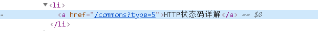
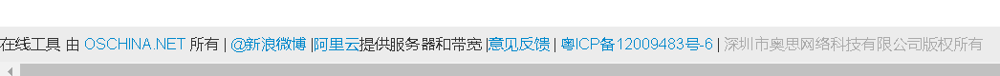
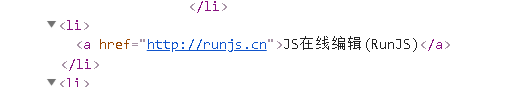

# StationMater
 开源中国工具网 *http://tool.oschina.net* 是一个对程序员十分友好的网站，里面有很多可供使用的在线工具。request库是python中非常简单的一个网页处理库，相比于Scrapy这样的大型爬虫库，request库更容易上手，再配合BeautifulSoup和re库的正则表达式，非常容易上手，这篇文章就以站长之家为样本，爬取下主页工具的链接网址。

## 一、网页分析

工具网网页非常简单，用来爬虫入门那是相当方便。当然，选择这个网站最主要的原因还是因为他真的很好用，在爬取内容的同时学一些技术也是很好的。站长值加的首页上非常简单，里面就包含了我们想要的所有东西，**我们的的目标就是做成一个网站工具的目录，将工具与网站一一对应，然后用.txt文件存储起来方便使用**

首先还是看分析网页，对于爬虫来说，页面简单其实并不是一件好事儿，因为爬虫主要靠的就是目标信息被拥有特征class或者id或者name的标签给包裹起来，依据这种特征找目标。

可以看看我们想要的标题和链接：

真的是非常简单，可能有很多人就会说，直接获取整个页面的\<a\>标签就行,但是很明显这个页面的所有\<a\>标签中不一定全部都是我们的目标内容，比如说开源中国的标志，这种标志一般都会有到主页的链接，而且不是\<a\>标签，所以这并不是我们所需要的东西，又或者说有一些是\<a\>标签但是却不是我们所需要的标签，一般出现在网页的下端，诸如此类：

要排除这些干扰项我们需要用几种方法相结合。

## 二、代码实操

### 1、request
首先我们应该先熟悉一下request库，request库的基本用法其实就是模仿http协议获得html的内容，一般情况下我们使用的GET和POST都能满足，如果是要爬取大量的内容，request库还能提供定制header请求头的甚至是生成Cookie，当然这些都是在爬取大量内容的时候作为隐蔽用的，爬取简单的网页就用简单的POST和GET就能实现。

request库既然是模拟http协议，那么我们在操作网页的时候能得到什么样的东西，那么他也能得到一样的东西，常见的就是获得html或者获得JSON数据，两者都很有用，我的另一篇Github里面就用到了request获取JSON来获得股票信息。在这一次的实现中，我们想要爬取的是页面中的信息，所以应该要得到的是html的内容，方法很简单，其实对于request库而言，得到什么样的返回值都是一样的，不一样的是要我们自己去处理，请求的格式如下：

    content = request.get("your_url")
    根据返回的内容：
    content.JSON 或者 content.text

这样就完成了请求，内容就存在了content里面，整个request库就用完了，当然为了伪装，你也可以自己设置一下header或者Cookie。

### 2、BeautifulSoup

BeautifulSoup（以下简称Soup，一般引用的时候都喜欢命名为soup）被认为是python爬虫利器之一，他能够从文本信息中提取HTML或者XML中的内容，个人感觉和js的jQuery库有很多相似，如果懂jQuery的朋友们就很方便了。soup.find_all就类似于jQuery的getElementBy_____，soup.find_all能够根据标签找，能够根据class找（用attr函数）。要用soup库的话先要传入目标文件，这个文件可以是磁盘中的文件也可以是缓存中的文件，一般在爬虫里面的话，用得最多的还是缓存中的内容，缓存中的内容就多了一步，得让soup知道缓存中的这些内容是一个什么样的文本，指明后就和普通的文件一样用：

    # 读取缓存中的内容并指明是html类型
    soup = BeautifulSoup(content, "html.parse")
    # 从磁盘中直接读取
    soup = BeautifulSoup(open("xxx.html"))
    # 甚至可以这样
    soup = BeautifulSoup("<html>helloworld</html>")

然后就是用，只管用，就像我们写html文件一样用，soup类中只要用好了find_all函数，什么都能实现，比如我们之前分析的，我们想要找\<a\>标签，那我们就：

    soup.fina_all("a")

如果是要根据某一个属性来查找的话，就应该是这样的：

    soup.find_all(attrs={"class":"XXXXXXX"})
    # 这里的{ }里面可以有多个属性

至此，我们从网页中得到的东西其实还是一种网页格式（具体地说是Soup格式）的东西，但其实python是不认识这种格式的，所以还要进行下一步的处理。

### 3、数据处理

我们想要的数据有两种，一个是标题一个是网址。先从简单的说起，标题，想要获得标题其实很简单，一行代码就可以搞定：

    title.append(atag[i].get_text())

这一行代码就是将我们之前所得到的所有\<a\>标签里面的text内容提取出来。

另一边就是连接，仔细看看网页上看到的链接：

我们可以看到在href属性中并不是我们所看到的有http头的一个地址，只有一个分级目录，这个主要是因为他的这些子网页都和服务器放在同样的地址，所以直接在href中这样写会自动加上域名信息。但是我们实际上要的是要带域名信息的。但是我看了看网页发现，有些是真的要跳转到别的网页的href是带了域名的，所以说处理起来得辨别一下。比如说这种;

加一个判断把域名加上就解决：

    if (i[:4] != "http"):
        url.append("http://tool.oschina.net/"+i[:-1])
    else:
        url.append(i[:-1])

如果我们直接用**Soup.find_all('a')['href']**这样来做是肯定可以的，但是我们之前说到过，有些在\<a\>里面的href又不一定是我们想要的href，所以在这里要分两步。最开始我直接用正则表达式去获取全部href的内容：

    lianjie = re.findall('href="(.*?\")', content)

但是这样并不行，因为很多图标、图片之类的都有href属性，所以又换成了这样：

    lianjie = re.findall('<a href="(.*?\")', con)

这样就是在\<a\>标签里面的href都get到了，后来想了想，既是有些\<a\>不是我们想要的，但是之前获得标题的时候我们也是把那些不想要的页一并获取了，所以到时候直接把我们不想要的切调就可以了。
### 4、粘合

获取到数据之后怎么粘合就要看数据来了，最开始的时候我做出来发现有错位，不能把url和title对齐，后来发现是有几个\<a\>里面没有标题，像这种静态页面，格式一般是不会改的，只要删调指定的某一个数据就完成任务了。